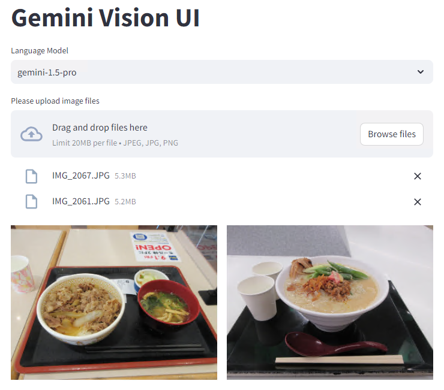

# gemini-vision-ui

Simple Web UI to try out Gemini Pro Vision.

# Setup

An example of the setup procedure is shown below.

```
$ git clone https://github.com/sh2/gemini-vision-ui.git
$ cd gemini-vision-ui/src
$ python3 -m venv .venv
$ source .venv/bin/activate
$ pip install -r requirements.txt
$ cd ..
$ cp template_script.sh script.sh
$ vim script.sh
$ ./script.sh
```

# Usage

First, please upload image files.
The format is JPEG or PNG and each file is limited to 20 MB.
Large images will be automatically scaled down.
You may upload multiple files.



Next, ask a question about the images,
and Gemini will return a message.

